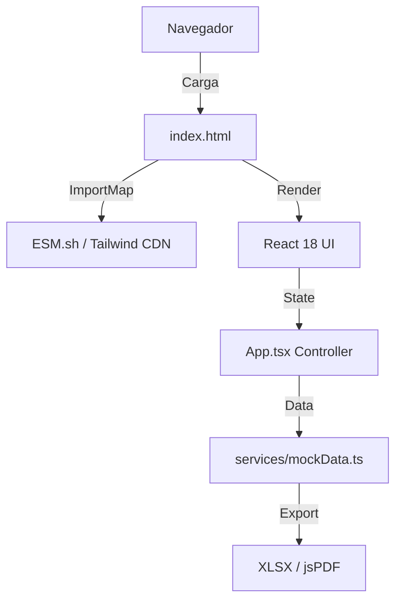

# Tacker SRL – Sistema de Gestión MASE (ERP)

**Versión:** 1.0.0 (Prototipo No-Build)  
**Estado:** Demo Funcional / Client-Side Only

---

## 1. Resumen Ejecutivo

### Propósito
Aplicación web de gestión de recursos (ERP/CRUD) desarrollada para el sector **MASE** (Medio Ambiente, Seguridad y Energía) de **Tacker SRL**. Su función principal es centralizar el inventario de equipos, flotas vehiculares y herramientas de seguridad, con un sistema automatizado para el monitoreo de **vencimientos críticos** (VTV, calibraciones, inspecciones técnicas).

### Casos de Uso
*   **Gestión de Flota:** Seguimiento de vencimientos de VTV, seguros y kilometraje de Pickups y Worklifts.
*   **Seguridad (HSE):** Control de fechas de calibración de detectores de gas y equipos ERA.
*   **Inventario:** Control de stock de materiales integrales (codos, líneas, válvulas).
*   **Listado Maestro:** Generación automática de reportes consolidados de activos.

### Usuarios Objetivo
*   Administradores de Pañol.
*   Responsables de Seguridad e Higiene.
*   Gerentes de Operaciones.

---

## 2. Arquitectura y Stack

### Patrón Arquitectónico
**Single Page Application (SPA) - No-Build:**
La aplicación se ejecuta completamente en el navegador utilizando módulos ES nativos (`ES Modules`) cargados vía CDN (`esm.sh`). No requiere un proceso de compilación tradicional (Webpack/Vite) para ejecutarse en desarrollo, aunque utiliza TypeScript transpilado al vuelo por el entorno de ejecución.

### Diagrama de Componentes


---

## 3. Dependencias y Herramientas

Las dependencias se gestionan exclusivamente a través del `importmap` en `index.html`.

### Frameworks y Librerías Principales
| Librería | Versión | Propósito |
| :--- | :--- | :--- |
| **React** | `18.2.0` | UI Library (Core). |
| **React DOM** | `18.2.0` | Renderizado web. |
| **Tailwind CSS** | `Latest` | Estilizado (vía Script CDN). |
| **Lucide React** | `0.344.0` | Iconografía SVG. |

### Utilidades
*   **XLSX** (`0.18.5`): Exportación de tablas a Excel.
*   **jsPDF** (`2.5.1`): Generación de reportes PDF.
*   **jsPDF-AutoTable** (`3.5.31`): Renderizado de tablas en PDF.

---

## 4. Estructura de Archivos y Carpetas

```text
/
├── index.html              # Punto de entrada. Configura importmap y estilos globales.
├── index.tsx               # Montaje del root de React.
├── App.tsx                 # Controlador principal. Router manual y gestión de vistas.
├── types.ts                # Interfaces TypeScript (Modelos de datos).
├── metadata.json           # Metadatos del proyecto y permisos.
├── components/             # Componentes de UI reutilizables.
│   ├── Layout.tsx          # Estructura (Sidebar, Header, Main).
│   ├── Dashboard.tsx       # Vista de KPIs y línea de tiempo de vencimientos.
│   ├── DataTable.tsx       # Tabla genérica con búsqueda, filtros y exportación.
│   └── StatusBadge.tsx     # Indicador visual de estados (Vencido, Vigente, etc.).
└── services/
    └── mockData.ts         # Base de datos en memoria y lógica de negocio (cálculos).
```

---

## 5. Rutas, Navegación y Endpoints

### Navegación Frontend
El proyecto **no utiliza** `react-router-dom`. Implementa un enrutamiento manual basado en estado (`activeModule`) en `App.tsx`.

**Módulos Principales:**
*   `dashboard`: Resumen ejecutivo.
*   `master_list`: Listado consolidado (Solo lectura).
*   `base`, `catalog`, `integrales`: Inventarios.
*   `worklift`, `pickups`, `trailers`: Gestión de flota.
*   `tanks`, `luminarias`, `handies`: Equipos auxiliares.
*   `tpr`, `hse_detectores`, `hse_era`: Seguridad y Calidad.
*   `config`: Configuración del sistema (Firebase setup).

### API / Backend
Actualmente **no existen endpoints HTTP**.
*   **Simulación:** Todas las operaciones (CRUD) se realizan sobre arrays en memoria en `services/mockData.ts`.
*   **Persistencia:** Los datos se reinician al recargar la página (volátiles).

---

## 6. Estado, Datos y Modelos

### Gestión de Estado
*   **Local:** `useState` en `App.tsx` maneja el módulo activo y la lista maestra.
*   **Prop Drilling:** Los datos fluyen desde `App` hacia `Layout` y `DataTable`.

### Modelos de Datos (`types.ts`)
El sistema es fuertemente tipado. Las entidades extienden de `BaseEntity`.

**Tipos Clave:**
```typescript
type ExpirationStatus = 'VIGENTE' | 'POR_VENCER' | 'VENCIDO' | 'CRITICO' | 'N/A';

interface BaseEntity {
  id: string;
  createdAt: string;
  updatedAt: string;
}
```

**Lógica de Negocio (Listado Maestro):**
La función `recalculateMasterCounts` (en `mockData.ts`) actúa como un trigger: recorre todos los módulos (Pickups, Worklifts, etc.) y actualiza los contadores en el `MasterList` automáticamente.

---

## 7. Base de Datos y Tablas (Simulada)

El almacenamiento es **In-Memory** (Arrays de objetos JS).

**Colecciones Principales:**
1.  **Worklifts:** Maquinaria pesada. Campos clave: `vtoInspeccion`, `nroSerie`.
2.  **Pickups:** Vehículos. Campos clave: `vtvVto`, `dominio`, `kmActual`.
3.  **HSE Items:** Detectores/ERA. Campos clave: `fechaVencimientoCalibracion`, `nroInstrumento`.
4.  **Integrales:** Materiales. Campos clave: `variante`, `cantidad`.

---

## 8. Servicios Externos e Integraciones

*   **Firebase (Pendiente):** La UI (`ConfigScreen`) está preparada para recibir un JSON de configuración, pero la lógica de conexión no está implementada en `services/`.
*   **ESM.sh:** CDN crítico para la carga de módulos React.

**Configuración requerida (Placeholder):**
```json
// En App.tsx > ConfigScreen
{
  "apiKey": "YOUR_FIREBASE_API_KEY",
  "authDomain": "YOUR_PROJECT_ID.firebaseapp.com",
  "projectId": "YOUR_PROJECT_ID"
}
```

---

## 9. Build, Scripts y Despliegue

### Build
No existe proceso de build (`npm run build`). El código se sirve tal cual (HTML + TSX transpilado en runtime).

### Despliegue
1.  **Requisitos:** Servidor web estático (Apache, Nginx, Vercel, Netlify) o contenedor simple.
2.  **Pasos:**
    *   Subir todo el contenido de la carpeta raíz.
    *   Asegurar que `index.html` sea el archivo por defecto.
    *   **Nota:** Requiere conexión a internet del cliente para descargar librerías de `esm.sh`.

---

## 10. Calidad, Testing y Seguridad

### Calidad
*   **Tipado:** Cobertura alta de TypeScript en interfaces.
*   **Linting:** No configurado (proyecto raw).

### Seguridad
*   **Autenticación:** Inexistente. Usuario hardcodeado ("Usuario Demo").
*   **Autorización:** Acceso total a todos los módulos.
*   **Datos:** Sin validación de entrada (Zod/Yup) en los formularios simulados (`alerts`).

---

## 11. Internacionalización y Accesibilidad

*   **Idioma:** Español (Hardcodeado).
*   **Fechas:** Formato ISO string en datos, visualización directa.
*   **Accesibilidad:** Contraste adecuado gracias a la paleta `slate` de Tailwind. Faltan etiquetas ARIA en botones de acción.

---

## 12. Observabilidad

*   No hay implementación de logs remotos (Sentry/LogRocket).
*   La depuración depende de `console.log` y DevTools del navegador.

---

## 13. Limpieza y Mantenimiento de Dependencias

### Corrección Crítica de Versiones React
Para evitar el error *"Objects are not valid as a React child"*, el `importmap` en `index.html` **debe** mantener consistencia estricta en la versión 18.

**Configuración Correcta (`index.html`):**
```json
"imports": {
  "react": "https://esm.sh/react@18.2.0?dev",
  "react-dom": "https://esm.sh/react-dom@18.2.0?dev&deps=react@18.2.0",
  "react/jsx-runtime": "https://esm.sh/react@18.2.0/jsx-runtime?dev"
  // ELIMINAR CUALQUIER REFERENCIA A react@^19.x.x
}
```

### Archivos a Eliminar
*   No se detectaron archivos huérfanos en la estructura actual provista.

---

## 14. Tareas Pendientes y Riesgos

### Deuda Técnica
1.  **Migración a Router:** Implementar `react-router-dom` para permitir navegación real y deep-linking.
2.  **Persistencia:** Conectar con Firebase/Supabase para que los datos sobrevivan al refresh.
3.  **Formularios:** Reemplazar los `alert()` y `prompt()` por modales con validación real (`react-hook-form`).

### Riesgos
*   **Pérdida de Datos:** En su estado actual, si el navegador se cierra, los datos ingresados se pierden irreversiblemente.
*   **Dependencia Externa:** Si `esm.sh` o `cdn.tailwindcss.com` caen, la aplicación deja de funcionar inmediatamente.
